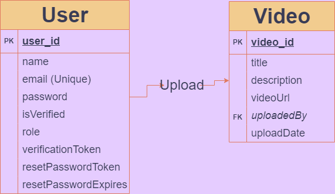

# Video Platform Backend

This repository contains the backend implementation for a Video Platform application built using Node.js, Express, MongoDB, and other technologies.

## Table of Contents

1. [Introduction](#introduction)
2. [Project Overview](#project-overview)
3. [Project Setup](#project-setup)
4. [Features](#features)
5. [Endpoints](#endpoints)
6. [Project Structure](#project-structure)
7. [ER Diagram](#er-diagram)
8. [Installation](#installation)
9. [Usage](#usage)
10. [Contributing](#contributing)
11. [License](#license)

## Introduction

This backend repository serves as the foundation for a Video Platform application. It includes features such as user authentication, admin video uploads, password reset functionalities, and more.

## Project Overview

### Project Title
Video Platform

### Project Objective
Paul Leonard, a video creator, needs a bespoke platform where he can upload videos for his customers under his brand. He is dissatisfied with existing video hosting platforms due to branding issues.

### Customer Requirements

#### User Features
- Signup and login with email and password, including account verification.
- Password reset feature for recovering lost passwords.
- Navigate through video pages.
- Share links to videos across different pages.

#### Admin Features
- Upload videos with a title and description.
- Edit and delete videos.

#### Video Page Features
- Display a single video.
- Include next and previous buttons to load new pages with different videos.
- Hide previous or next buttons if there are no more videos to navigate.
- Common video control buttons for user interaction.
- Prominent display of the business logo at the top.
- Share button for users to share links to the video page.

## Project Setup

### Technologies Used

- Node.js
- Express.js
- MongoDB

### Dependencies

```json
{
  "dependencies": {
    "bcrypt": "^5.1.1",
    "bcryptjs": "^2.4.3",
    "body-parser": "^1.20.2",
    "cors": "^2.8.5",
    "crypto": "^1.0.1",
    "dotenv": "^16.4.5",
    "express": "^4.19.2",
    "express-validator": "^7.1.0",
    "http": "^0.0.1-security",
    "jsonwebtoken": "^9.0.2",
    "mongoose": "^8.5.1",
    "nodemailer": "^6.9.14",
    "nodemon": "^3.1.4"
  }
}
```

## Features

- **User Authentication**: Allows users to sign up, log in, and verify their email addresses.
- **Password Reset**: Provides functionality for users to reset their passwords via email.
- **Admin Video Upload**: Enables administrators to upload videos to the platform.

## Endpoints

### Authentication

- **POST /api/auth/signup**: Register a new user.
- **POST /api/auth/login**: Authenticate user and get a JWT token.
- **GET /api/auth/verify/:token**: Verify user's email address.
- **POST /api/auth/forgot-password**: Initiate password reset process.
- **POST /api/auth/reset-password/:token**: Reset user's password.

### Videos

- **POST /api/videos/upload**: Upload a new video (requires admin privileges).
- **GET /api/videos/:id**: Fetch a specific video.
- **GET /api/videos/**: Fetch all videos.
- **DELETE /api/videos/:id**: Delete a video (requires admin privileges).
- **PUT /api/videos/:id**: Update a video (requires admin privileges).

### Users

- **GET /api/users/:id**: Fetch a specific user (requires authentication).
- **GET /api/users/**: Fetch all users (requires authentication).

## Project Structure

The project structure is organized as follows:

```
project-root
│
├── index.js           # Entry point of the application
├── routes/            # Directory for route definitions
│   ├── AuthRoute.js        # Authentication routes
│   ├── UserRoute.js       # User routes
│   └── VideoRoute.js      # Video routes
├── models/            # Directory for Mongoose models
│   ├── userModel.js        # User model
│   └── videoModel.js       # Video model
├── controllers/       # Directory for route controllers
│   └── AuthController.js  # Controller for auth-related actions
│   └── UserController.js  # Controller for user-related actions
│   └── VideoController.js  # Controller for video-related actions
├── middleware/        # Directory for middleware functions
│   ├── authMiddleware.js        # Authentication middleware
│   └── adminMiddleware.js       # Admin role verification middleware
│   └── validateEmail.js       # Email validation middleware
├── ER-diagram.png     # Entity-Relationship diagram illustrating database structure
├── .env       # Environment variables configuration file (e.g., MONGODB_CONNECTION, JWTKEY, etc )
├── .gitignore         # Git ignore file
├── package.json       # Node.js dependencies and scripts
└── README.md          # Project README file
```

## ER Diagram

Include your ER diagram here, illustrating the database structure of your application.



## Installation

To run this project locally, clone the repository and install dependencies using npm:

### 1. Clone the repository:

```bash
git clone https://github.com/Holystick5155/bespoke-video-platform.git
```

### 2. Project directory
```bash
cd <project-folder>
```

### 3. Install dependencies:
```bash
npm install
```

### 4. Set up environmental variables:
- Create a `.env` file in the root directory and configure the necessary variables (e.g., `MONGODB_CONNECTION`, `JWTKEY`, `EMAIL`, `PASSWORD`, `LOCALPORT`). In this project, a `.env` file has already been created for testing.

## Usage

Before running the application, make sure to set up your MongoDB connection and configure environment variables (see `.env`).

```bash
# Start the server
npm start
```

- Access the API at `http://localhost:5080/api`
- Use tools like **Postman** or **Thunder Client** to test the endpoints.
- For email verification and password reset purposes, kindly use a valid email address in order to receive verification and reset password tokens.

## Contributing

Contributions are welcome! Fork the repository and submit a pull request for any enhancements or fixes.

## License

This project is licensed under the [ISC License](https://opensource.org/licenses/ISC).
